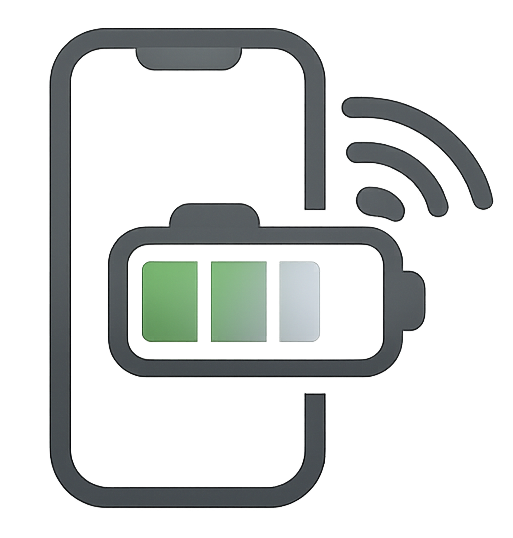

<p align="center">
  
</p>

<h1 align="center">BatteryIPhoneStatus</h1>

<p align="center">
  <strong>Monitoreo bidireccional de bateria entre iPhone y Mac</strong>
</p>

<p align="center">
  
  
  
  
  
  
</p>

---

Aplicacion nativa Swift que permite monitorear la bateria de tu iPhone desde tu Mac y viceversa. La Mac muestra el nivel del iPhone en la barra de menu, y el iPhone muestra el nivel de la Mac en la app y en un widget. Sin servidores externos, sin configuracion de IPs, sin atajos complicados. Solo dos apps que se descubren automaticamente en tu red local via Bonjour.

## Caracteristicas

- **Monitoreo bidireccional** — Mac ve bateria del iPhone, iPhone ve bateria de la Mac
- **Menu bar nativo** — Nivel de bateria del iPhone siempre visible en la barra de menu del Mac
- **Widget iOS** — Widget para home screen del iPhone que muestra bateria de la Mac en tiempo real
- **Descubrimiento automatico** — Las apps se encuentran solas via Bonjour/mDNS. Sin configurar IPs ni puertos
- **Comunicacion bidireccional** — Misma conexion TCP envia datos en ambas direcciones
- **Notificaciones inteligentes** — Alertas nativas en Mac e iPhone:
  - Bateria baja (20%)
  - Bateria critica (10%)
  - Carga completa (100%)
- **Estado de carga** — Muestra si el dispositivo esta cargando, desconectado o completamente cargado
- **Iconos dinamicos** — Icono en menu bar cambia segun nivel de bateria
- **Background execution** — La app iOS sigue enviando datos con la pantalla apagada via BGTaskScheduler
- **Precision al 1%** — Bateria de la Mac se lee via IOKit con precision al 1% (iOS tiene granularidad de 5% por limitacion del sistema)
- **Logo personalizado** — Icono de app propio en ambas plataformas
- **Creditos integrados** — Links a GitHub y LinkedIn dentro de las apps

## Arquitectura

El proyecto esta compuesto por tres modulos independientes con comunicacion bidireccional:

```
┌─────────────────────┐      Bonjour + TCP (JSON)       ┌─────────────────────┐
│   BatterySenderIOS  │ ──────────────────────────────>  │  BatteryMonitorMac  │
│     (iPhone app)    │   iPhone battery -> Mac          │  (macOS menu bar)   │
│                     │ <──────────────────────────────  │                     │
│  + Widget (Mac bat) │   Mac battery -> iPhone          │  + MacBatteryMgr    │
└─────────────────────┘                                  └─────────────────────┘
         │                                                        │
         └───────────────┐                    ┌───────────────────┘
                         │                    │
                    ┌────┴────────────────────┴────┐
                    │        BatteryShared         │
                    │  (Swift Package — modelos,   │
                    │   constantes, SharedStorage)  │
                    └──────────────────────────────┘
```

### BatteryShared (Swift Package)

Paquete compartido entre ambas apps y widgets. Contiene:

| Archivo | Descripcion |
|---------|-------------|
| `BatteryData.swift` | Modelo `Codable` con nivel, estado, nombre del dispositivo y timestamp |
| `NetworkConstants.swift` | Tipo de servicio Bonjour (`_batterymon._tcp`), parametros de red TCP |
| `SharedStorage.swift` | Lectura/escritura en UserDefaults (App Groups) para widgets |

### BatteryMonitorMac (macOS 14+)

App de barra de menu que recibe datos del iPhone y envia bateria de la Mac.

| Archivo | Descripcion |
|---------|-------------|
| `BatteryMonitorApp.swift` | Entry point, configura `MenuBarExtra` con icono dinamico |
| `BatteryReceiver.swift` | Servidor Bonjour + NWListener, recibe datos, envia bateria Mac, gestiona notificaciones |
| `MenuBarView.swift` | UI del popover: gauge de bateria, estado, timestamp, creditos |
| `MacBatteryManager.swift` | Lee bateria de la Mac via IOKit (precision al 1%) |

**Widget Extension (iPhoneBatteryWidgetExtension):**

| Archivo | Descripcion |
|---------|-------------|
| `iPhoneBatteryWidget.swift` | Widget para escritorio macOS que muestra bateria del iPhone |

### BatterySenderIOS (iOS 17+)

App que lee la bateria del iPhone, la envia al Mac y muestra bateria de la Mac.

| Archivo | Descripcion |
|---------|-------------|
| `BatterySenderApp.swift` | Entry point con AppDelegate para BGTaskScheduler |
| `BatteryManager.swift` | Lee `UIDevice.batteryLevel`, observa cambios, notificaciones locales |
| `NetworkSender.swift` | Busca Mac via Bonjour, envia datos y recibe bateria de la Mac |
| `ContentView.swift` | UI mostrando bateria de la Mac con circulo animado |

**Widget Extension (MacBatteryWidgetExtension):**

| Archivo | Descripcion |
|---------|-------------|
| `MacBatteryWidget.swift` | Widget para home screen iOS que muestra bateria de la Mac |

## Stack tecnologico

| Componente | Tecnologia |
|------------|------------|
| Lenguaje | Swift 5.9 |
| UI Framework | SwiftUI |
| Widgets | WidgetKit |
| Networking | Network.framework (NWListener, NWBrowser, NWConnection) |
| Descubrimiento | Bonjour / mDNS |
| Notificaciones | UserNotifications (UNUserNotificationCenter) |
| Bateria iOS | UIDevice.batteryLevel + batteryState |
| Bateria macOS | IOKit (IOPSCopyPowerSourcesInfo) |
| Background | BGTaskScheduler + beginBackgroundTask |
| Datos compartidos | App Groups + UserDefaults |
| Generacion de proyecto | XcodeGen |
| Codigo compartido | Swift Package Manager |

## Requisitos

| Requisito | Detalle |
|-----------|---------|
| Mac | Apple Silicon (M1 o superior) con macOS 14 Sonoma o posterior |
| iPhone | iPhone con iOS 17 o posterior |
| Red | Ambos dispositivos conectados a la misma red WiFi |
| Xcode | Version 15 o posterior (para compilar e instalar en iPhone) |
| Apple ID | Necesario para firmar la app iOS (cuenta gratuita funciona) |
| XcodeGen | Para generar proyectos Xcode (`brew install xcodegen`) |

## Instalacion

### 1. Clonar el repositorio

```bash
git clone https://github.com/JhojanAlexanderCalambasRamirez/BatteryIPhoneStatus.git
cd BatteryIPhoneStatus
```

### 2. Generar proyectos Xcode

```bash
brew install xcodegen

cd BatteryMonitorMac && xcodegen generate && cd ..
cd BatterySenderIOS && xcodegen generate && cd ..
```

### 3. Abrir workspace

```bash
open BatteryMonitor.xcworkspace
```

### 4. Configurar signing

En Xcode, para cada target (BatteryMonitorMac, iPhoneBatteryWidgetExtension, BatterySenderIOS, MacBatteryWidgetExtension):

1. Seleccionar target en el navegador de proyectos
2. Tab Signing & Capabilities
3. Activar "Automatically manage signing"
4. Seleccionar tu Apple ID como Team

### 5. Compilar e instalar app macOS

1. Seleccionar scheme **BatteryMonitorMac** con destino **My Mac**
2. Run (Cmd+R)
3. Aparece icono de bateria en la barra de menu
4. Si el firewall pregunta, permitir conexiones entrantes

**Para uso permanente:**
- Product > Archive > Distribute App > Direct Distribution
- Mover `BatteryMonitorMac.app` a `/Applications`
- System Settings > General > Login Items > Agregar la app para inicio automatico

### 6. Compilar e instalar app iOS

1. Seleccionar scheme **BatterySenderIOS** con destino tu iPhone
2. Run (Cmd+R)
3. En iPhone: Ajustes > General > VPN y administracion de dispositivos > Confiar en el perfil
4. Aceptar permisos de notificaciones cuando la app pregunte

**Nota sobre cuenta gratuita:** La app expira cada 7 dias con cuenta gratuita de Apple. Para renovar, conectar el iPhone al Mac y ejecutar Run desde Xcode nuevamente. Con Apple Developer Program ($99 USD/anio) la app no expira.

### 7. Agregar widget en iPhone

1. Mantener presionado en home screen hasta que los iconos tiemblen
2. Tocar "+" arriba a la izquierda
3. Buscar "Mac Battery" o "BatterySender"
4. Seleccionar tamano (pequeno o mediano)
5. Tocar "Agregar Widget"

## Uso

1. **Abrir BatteryMonitorMac** en el Mac — aparece icono de bateria en la barra de menu
2. **Abrir Battery Sender** en el iPhone — muestra bateria de la Mac
3. Ambas apps se detectan automaticamente via WiFi
4. Click en el icono de bateria en menu bar para ver: nivel, estado, dispositivo y timestamp
5. Widget en iPhone muestra bateria de la Mac en el home screen
6. Las notificaciones llegan automaticamente en ambos dispositivos

## Estructura del proyecto

```
BatteryIPhoneStatus/
├── BatteryShared/                    # Swift Package compartido
│   ├── Package.swift
│   └── Sources/BatteryShared/
│       ├── BatteryData.swift         # Modelo de datos
│       ├── NetworkConstants.swift    # Constantes Bonjour y red
│       └── SharedStorage.swift       # Almacenamiento para widgets
├── BatteryMonitorMac/                # App macOS (menu bar)
│   ├── project.yml                   # Config XcodeGen
│   ├── Sources/
│   │   ├── BatteryMonitorApp.swift   # Entry point
│   │   ├── BatteryReceiver.swift     # Servidor Bonjour + receptor
│   │   ├── MacBatteryManager.swift   # Lectura bateria Mac (IOKit)
│   │   └── MenuBarView.swift         # UI del menu
│   ├── Widget/
│   │   └── iPhoneBatteryWidget.swift # Widget macOS
│   └── Resources/
│       ├── Info.plist
│       ├── BatteryMonitorMac.entitlements
│       └── Assets.xcassets/          # App icon
├── BatterySenderIOS/                 # App iOS (sender + viewer)
│   ├── project.yml                   # Config XcodeGen
│   ├── Sources/
│   │   ├── BatterySenderApp.swift    # Entry point + AppDelegate
│   │   ├── BatteryManager.swift      # Monitor bateria + notificaciones
│   │   ├── NetworkSender.swift       # Cliente Bonjour + bidireccional
│   │   └── ContentView.swift         # UI bateria Mac
│   ├── Widget/
│   │   └── MacBatteryWidget.swift    # Widget iOS
│   └── Resources/
│       ├── Info.plist
│       └── Assets.xcassets/          # App icon
├── BatteryMonitor.xcworkspace        # Workspace unificado
├── Images/
│   └── LogoBatteryApp.png            # Logo de la app
├── LICENSE                           # MIT License
└── README.md
```

## Protocolo de comunicacion

Las apps se comunican usando un protocolo bidireccional sobre TCP en la red local:

1. **Descubrimiento:** Mac publica servicio Bonjour `_batterymon._tcp`. iPhone lo busca con `NWBrowser`.
2. **Conexion:** iPhone establece conexion TCP via `NWConnection` al endpoint descubierto.
3. **iPhone -> Mac:** iPhone envia nivel de bateria cada 30 segundos o cuando cambia.
4. **Mac -> iPhone:** Mac envia su nivel de bateria cada 30 segundos por la misma conexion.
5. **Widgets:** Cada app guarda los datos recibidos en App Groups (UserDefaults) para que los widgets puedan leerlos.

**Formato del mensaje (ambas direcciones):**

```json
{
  "level": 85,
  "state": "charging",
  "deviceName": "iPhone de Alexander",
  "timestamp": "2026-06-22T23:30:00Z"
}
```

**Estados posibles:** `unknown`, `unplugged`, `charging`, `full`

## Limitaciones conocidas

- **Precision de bateria iOS:** `UIDevice.batteryLevel` reporta en saltos de 5% (100, 95, 90...). El porcentaje exacto del status bar usa una API privada de Apple no accesible para apps. La bateria de la Mac SI se lee al 1% via IOKit.
- **Background iOS:** Cuando la app esta en segundo plano, iOS controla la frecuencia de actualizacion via BGTaskScheduler (aproximadamente cada 15-30 minutos). Con la app en primer plano, las actualizaciones son cada 30 segundos.
- **Cuenta gratuita Apple:** La app iOS expira cada 7 dias y requiere reinstalacion desde Xcode.
- **Widget macOS:** En desarrollo. Actualmente el widget funciona en iPhone pero no en macOS.

## Autor

<p align="center">
  <strong>Dev J4CR</strong> — Alexander Calambas
</p>

<p align="center">
  <a href="https://github.com/JhojanAlexanderCalambasRamirez">GitHub</a> •
  <a href="https://www.linkedin.com/in/j4cr/">LinkedIn</a>
</p>

## Licencia

Este proyecto esta bajo la Licencia MIT. Ver el archivo [LICENSE](LICENSE) para mas detalles.
